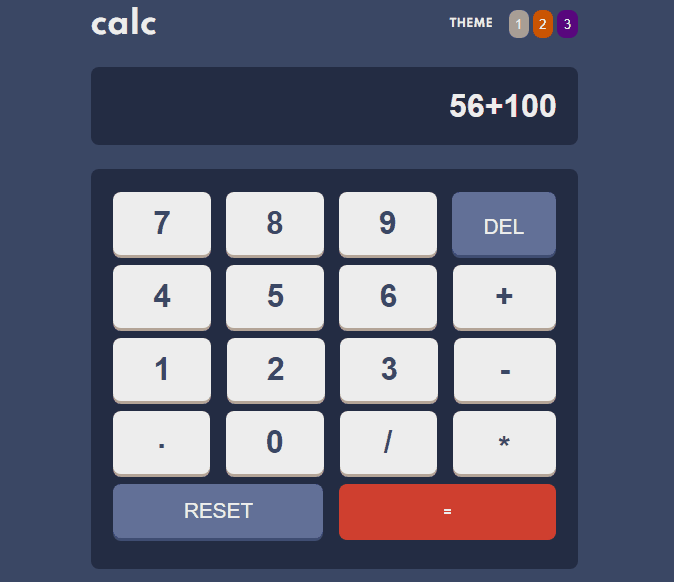

# Frontend Mentor - Calculator app solution

This is a solution to the [Calculator app challenge on Frontend Mentor](https://www.frontendmentor.io/challenges/calculator-app-9lteq5N29). 

## Table of contents

- [Overview](#overview)
  - [The challenge](#the-challenge)
  - [Screenshot](#screenshot)
- [My process](#my-process)
  - [Built with](#built-with)
- [Author](#author)
- [Requisite](#requisite)
  - [Running](#running)

 

## Overview

### The challenge

Users should be able to:

- See the size of the elements adjust based on their device's screen size
- Perform mathmatical operations like addition, subtraction, multiplication, and division
- Adjust the color theme based on their preference

### Screenshot

<h1 align="center">
  
</h1>

 

## My process

### Built with

- HTML5
- CSS
- JavaScript

 

## Author

- Linkedin - [Ian Hadrien](https://www.linkedin.com/in/ian-hadrien-8051181b1/)

